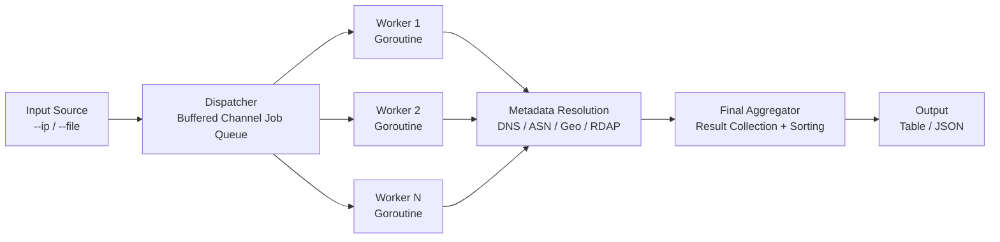

# ip-lookup-go

`ip-lookup` is a concurrency-optimised network attribution engine for rapid IP intelligence enrichment.

It is designed for high-throughput infrastructure mapping where each target IP must be attributed to operational context, including:

- ASN
- organisation
- BGP prefix
- RIR inference
- abuse contact
- PTR hostname
- country and source metadata

The utility orchestrates parallel resolution across multiple data sources and returns deterministic, machine-ingestible output for SOC, NOC, and threat intelligence workflows.

---

## Why this tool exists

Modern network operations require fast attribution for large IP sets from telemetry, detections, and abuse feeds. Sequential lookup pipelines are too slow and fragile for incident response timelines.

`ip-lookup` applies bounded concurrency, per-target timeout isolation, and structured output to make attribution reliable at scale.

---

## Architecture

### Fan-out / Fan-in execution model

The scanner uses a buffered job queue and a fixed worker pool.

- **Fan-out:** target IPs are normalised, validated, and pushed to a channel.
- **Execution:** workers perform metadata resolution in parallel.
- **Fan-in:** results are collected by an aggregator and rendered in sorted output.



---

## Core technical features

### Non-blocking network I/O with timeout isolation

Each lookup is guarded with `context.Context` and strict timeout boundaries.

- per-lookup timeout is configurable (`--timeout`)
- a single hanging socket does not block the worker pool
- failures are isolated per target and captured in result output

### Data normalisation and validation

Before queue dispatch, inputs are sanitised and canonicalised.

- trims whitespace and comments
- validates IPv4 and IPv6 using Go `net` primitives
- deduplicates targets
- normalises representation for deterministic sort and stable output

### Memory efficiency

The tool uses streaming-like fan-out/fan-in patterns with low allocation pressure.

- bounded worker count controls in-flight requests
- buffered channels avoid unbounded goroutine growth
- result structs are compact and suitable for very large target lists

This allows processing of very large IP batches with predictable memory usage.

---

## Output model and integration

### Human-readable table (default)

Use table mode for analyst triage and quick terminal workflows.

### JSON for pluggable automation

Structured JSON output is suitable for direct ingestion into:

- SOAR playbooks
- SIEM enrichment pipelines
- BGP monitoring suites
- custom threat correlation services

Example:

```bash
./ip-lookup --file ips.txt --workers 80 --timeout 2s --json > ip-attribution.json
```

---

## Build

### Build both Linux and Windows binaries

```bash
cd tools/ip-lookup-go
./build.sh
```

### Manual build (Linux)

```bash
CGO_ENABLED=0 GOOS=linux GOARCH=amd64 go build -trimpath -ldflags "-s -w" -o ip-lookup .
```

### Manual cross-compile (Windows)

```bash
CGO_ENABLED=0 GOOS=windows GOARCH=amd64 go build -trimpath -ldflags "-s -w" -o ip-lookup.exe .
```

---

## Usage

### Single target

```bash
./ip-lookup --ip 8.8.8.8
```

### Batch mode

```bash
./ip-lookup --file ips.txt --workers 50
```

### JSON output

```bash
./ip-lookup --file ips.txt --workers 50 --json
```

### Author metadata

```bash
./ip-lookup -a
```

---

## Performance tuning

High-throughput settings must be tuned to system limits, particularly file descriptors.

### Practical guidance

- Start with `--workers 20` to `--workers 80`.
- Increase `--workers` only if network and resolver stack remain stable.
- Keep `--timeout` tight for internet-wide scans, for example `1s` to `3s`.
- For slower or high-latency targets, increase timeout before increasing workers.

### `ulimit` considerations

If worker concurrency exceeds available descriptors, connection attempts will fail intermittently.

Check limit:

```bash
ulimit -n
```

Raise for batch scanning where appropriate:

```bash
ulimit -n 8192
```

Then tune workers proportionally and observe error rate.

---

## Reliability and error handling

- Input parsing errors are rejected early.
- Lookup failures are recorded per target, never fatal to the full batch.
- Output remains complete and deterministic even with partial network failure.

This behaviour makes the utility safe for continuous operational use and scheduled enrichment jobs.
